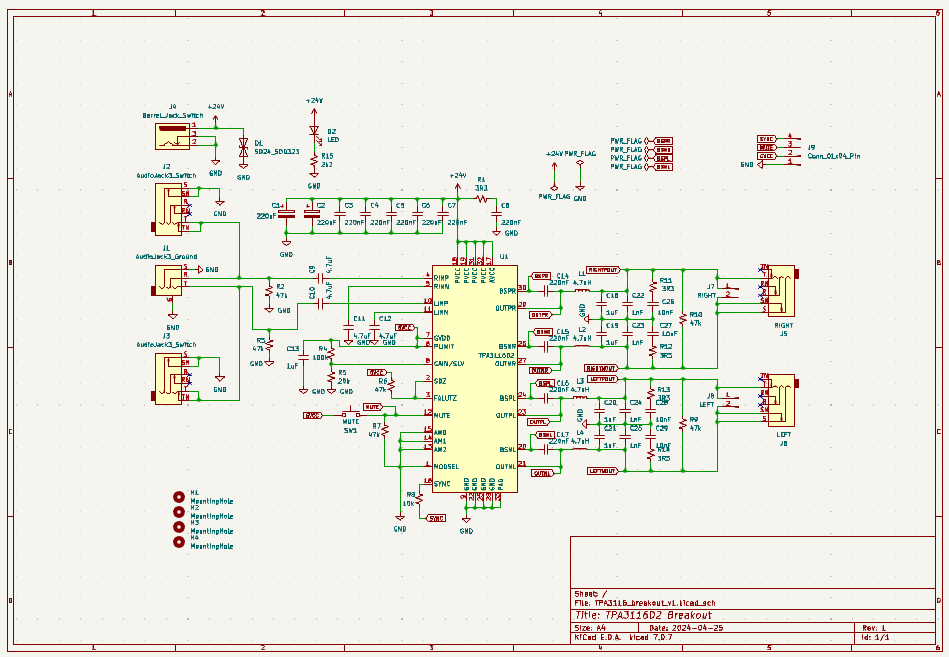
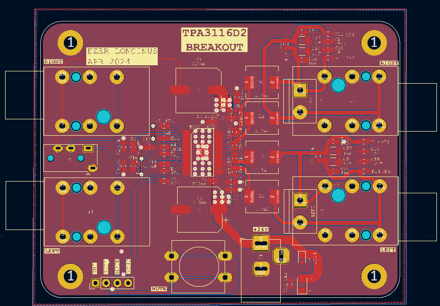
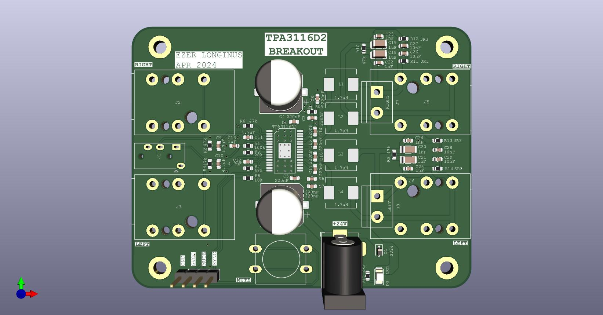

# TPA3116_breakout

Basic development board for the TPA3116D2 class D audio amplifier chip.  There is another repo with this chip and board breakout, but was specifically for EagleCAD software.  There are some slight design changes to this in regards to the input and output connectors, assumed +24V input supply, and a gain setting for 26dB.  The schematic mostly follows the [datasheet](https://www.ti.com/lit/ds/symlink/tpa3116d2.pdf?ts=1714035108546&ref_url=https%253A%252F%252Fwww.ti.com%252Fproduct%252FTPA3116D2) 

## Purpose
I had a lot of spare TPA3116 parts lying around from a previous project, and I wanted to build something with them.  Likely this will be installed in some small amplifier I build later, but this was mostly to get some use out of these chips, but they get tucked away again.

## Scematic

## Layout

## Rendering

## To Do
* Populate board when it arrives
* Test (and likely fix isses with) board
* Design and build enclosure for the amplifier